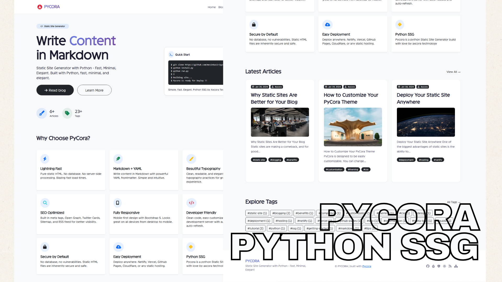

# 🚀 PyCora - Static Site Generator


**Python • Markdown • YAML • Fast • Minimal • Elegant**

Read Docs: [https://pycora.axcora.com/docs](https://pycora.axcora.com/docs)



---

## 📖 Table of Contents

- [✨ Features](#-features)
- [📋 Requirements](#-requirements)
- [🚀 Quick Start](#-quick-start)
- [📖 Usage](#-usage)
- [📁 Project Structure](#-project-structure)
- [📝 Content Format](#-content-format)
- [⚙️ Configuration](#️-configuration)
- [🎨 Customization](#-customization)
- [🌐 Deployment](#-deployment)
- [🤝 Contributing](#-contributing)
- [📄 License](#-license)
- [🙏 Credits](#-credits)
- [📞 Contact](#-contact)

---

## ✨ Features

| Feature | Description |
|---------|-------------|
| ⚡ **Lightning Fast** | Pure static HTML, no database, no server-side processing |
| 📝 **Markdown + YAML** | Write content in Markdown with powerful YAML frontmatter |
| 🏷️ **Tags & Categories** | Automatic tag generation from your content |
| 📄 **Pagination** | Built-in blog pagination |
| 🔍 **SEO Ready** | Meta tags, Open Graph, Twitter Cards, Sitemap, RSS feed |
| 🎨 **Beautiful Typography** | Clean, readable design with best typography practices |
| 📱 **Responsive** | Mobile-first design with Bootstrap 5 |
| 🔥 **Live Development** | Auto-rebuild on file changes |
| 🗺️ **Sitemap & RSS** | Automatic sitemap.xml and feed.xml generation |
| 🎯 **Zero Dependencies** | Minimal dependencies, lightweight |

---

## 📋 Requirements

- **Python** 3.8 or higher
- **pip** (Python package manager)
- **Git** (optional, for cloning)

---

## 🚀 Quick Start

### 1. Clone the repository

```bash
git clone https://github.com/mesinkasir/pycora.git
cd pycora
```

### 2. Install dependencies (One command)

```bash
python install.py
```

### 3. Run the site

```bash
python run.py
```

### 4. Build the site

```bash
python ssg.py
```

### 5. Preview locally

```bash
python dev.py
```

**Or using npm:**

```bash
npm run dev
```

---

## 📖 Usage

### 🏗️ Build Site

```bash
python ssg.py
```

Generates the static site in the `output/` directory.

**Output:**
```
🚀 Building site...
✅ Selesai! 2 posts, 2 tags.
📁 Output di folder: output/
```

---

### 🔥 Development Server (Auto-rebuild)

```bash
python dev.py
```

Starts a local server with auto-rebuild on file changes.

**Features:**
- Auto-rebuild when files change
- Live preview at `http://localhost:8000`
- Watch: `content/`, `templates/`, `static/`

---

### 🎯 Menu Interface

```bash
python run.py
```

Interactive menu for all commands:

```
  [1] Build site (ssg.py)
  [2] Development server (dev.py)
  [3] Install/Update dependencies
  [4] Exit
```

---

### 📦 NPM Scripts

```bash
npm run build   # Build site
npm run dev     # Development server
npm run serve   # Serve output directory
npm run menu    # Menu interface
npm run install # Install dependencies
```

---

## 📁 Project Structure

```
pycora/
├── content/
│   ├── posts/           # Blog posts (Markdown + YAML)
│   │   └── 2024-01-01-hello-world.md
│   └── pages/           # Static pages (Markdown + YAML)
│       └── about.md
│
├── templates/           # Jinja2 templates
│   ├── base.html        # Base layout
│   ├── landing.html     # Homepage
│   ├── blog.html        # Blog listing
│   ├── post.html        # Single post
│   ├── page.html        # Static page
│   ├── tags.html        # Tags index
│   ├── tag.html         # Tag detail
│   ├── feed.xml         # RSS feed template
│   └── sitemap.xml      # Sitemap template
│
├── static/              # Static assets
│   ├── css/
│   │   ├── bs.css
│   │   └── main.css
│   ├── images/
│   └── js/
│
├── output/              # Generated site (build output)
│   ├── index.html
│   ├── blog/
│   ├── tags/
│   ├── feed.xml
│   └── sitemap.xml
│
├── ssg.py               # Main builder
├── dev.py               # Development server
├── install.py           # Dependency installer
├── run.py               # Menu interface
├── config.yaml          # Site configuration
├── package.json         # NPM scripts
├── requirements.txt     # Python dependencies
└── README.md            # This file
```

---

## 📝 Content Format

### 📄 Blog Post (Markdown + YAML)

**File:** `content/posts/2024-01-01-hello-world.md`

```markdown
---
title: Hello World
description: Welcome to my blog
date: 2024-01-01
author: Your Name
tags:
  - python
  - ssg
  - markdown
image: /images/hello-world.jpg
layout: post
---

# Welcome to My Blog

This is my first post using PyCora.

## Why Static?

- **Fast** - No database queries
- **Secure** - No vulnerabilities
- **Simple** - Write in Markdown

```python
print("Hello, PyCora!")
```

### Features

- ✅ Markdown with YAML frontmatter
- ✅ Beautiful typography
- ✅ Tags & categories
- ✅ Pagination
- ✅ Next/Previous posts
- ✅ Responsive design
```

---

### 📄 Static Page

**File:** `content/pages/about.md`

```markdown
---
title: About Me
description: Learn more about me
date: 2024-01-01
layout: page
---

# About Me

This is the about page.
```

---

## ⚙️ Configuration

### `config.yaml`

```yaml
site:
  name: PyCora
  description: Static Site Generator with Python
  url: http://localhost:8000
  author: Your Name
  twitter_username: yourusername

  nav:
    list:
      - name: Home
        url: /
      - name: Blog
        url: /blog
      - name: About
        url: /about

  hero:
    icon: fas fa-code
    info: Static Site Generator
    title: Write
    sub_title: Content
    title2: in Markdown
    text: "Static Site Generator with Python - Fast, Minimal, Elegant."
    button1:
      text: Read blog
      url: /blog/
    button2:
      text: Learn More
      url: /about/
    terminal:
      title: Quick Start
      info: "Simple. Fast. Elegant."
      list:
        - text: "$ python ssg.py build"
        - text: "$ Building site..."
        - text: "$ Pycora is ready for Deploy !!"

  features:
    title: A Features
    list:
      - icon: "fas fa-bolt text-primary"
        title: Lightning Fast
        text: "Pure static HTML. No database. No server-side processing."
      - icon: "fas fa-feather text-success"
        title: "Markdown + YAML"
        text: "Write in Markdown with YAML frontmatter. Simple and powerful."
      - icon: "fas fa-paint-brush text-warning"
        title: "Beautiful Typography"
        text: "Clean, readable, and elegant design with best typography practices."

  footer:
    list:
      - name: Github
        icon: fab fa-github
        url: https://github.com/yourusername
      - name: Twitter
        icon: fab fa-twitter
        url: https://twitter.com/yourusername
```

---

## 🎨 Customization

### 🎨 CSS
Place your custom CSS in `static/css/main.css`

### 📁 Templates
Edit Jinja2 templates in the `templates/` directory:

| Template | Description |
|----------|-------------|
| `base.html` | Base layout with navbar, footer, SEO meta |
| `landing.html` | Homepage with hero, features, latest posts |
| `blog.html` | Blog listing with pagination |
| `post.html` | Single post with author, tags, next/prev |
| `page.html` | Static page layout |
| `tags.html` | Tags index page |
| `tag.html` | Posts filtered by tag |

### 📁 Static Assets
Add images, fonts, or other assets to the `static/` directory.

### 🔧 SEO & Social
Edit `base.html` to customize:
- Open Graph tags
- Twitter Cards
- Meta descriptions
- Canonical URLs
- Favicon

---

## 🌐 Deployment

### 📦 GitHub Pages

```bash
# Build the site
python ssg.py

# Push output/ directory to gh-pages branch
git subtree push --prefix output origin gh-pages
```

### 🚀 Netlify / Vercel

```bash
# Build the site
python ssg.py

# Deploy the output/ directory
# Drag and drop output/ folder to Netlify/Vercel dashboard
```

### ☁️ Any Static Hosting

Just upload the `output/` directory to any static hosting service:
- **Netlify**
- **Vercel**
- **GitHub Pages**
- **Cloudflare Pages**
- **AWS S3**
- **Firebase Hosting**
- **Cpanel Hosting**

---

## 🤝 Contributing

1. Fork the repository
2. Create a feature branch (`git checkout -b feature/amazing`)
3. Commit your changes (`git commit -m 'Add amazing feature'`)
4. Push to the branch (`git push origin feature/amazing`)
5. Open a Pull Request

### Development Workflow

```bash
# Clone your fork
git clone https://github.com/yourusername/pycora.git

# Install dependencies
python install.py

# Start development server
python dev.py

# Build for production
python ssg.py
```

---

## 📄 License

MIT License - see [LICENSE](LICENSE) file for details.

---

## 🙏 Credits

### 📚 Libraries & Frameworks

| Library | Purpose |
|---------|---------|
| [Python](https://python.org) | Core programming language |
| [Python-Markdown](https://python-markdown.github.io/) | Markdown parsing |
| [Jinja2](https://jinja.palletsprojects.com/) | Templating engine |
| [Bootstrap 5](https://getbootstrap.com/) | Frontend framework |
| [Font Awesome](https://fontawesome.com/) | Icons |
| [PyYAML](https://pyyaml.org/) | YAML parsing |
| [python-frontmatter](https://github.com/eyeseast/python-frontmatter) | Frontmatter parsing |
| [Watchdog](https://github.com/gorakhargosh/watchdog) | File watching |

### 💻 Maintainers

- **Axcora Technology**

---

## 📞 Contact

| Platform | Link |
|----------|------|
| 🌐 Website | [pycora.axcora.com](https://pycora.axcora.com) |
| 💻 GitHub | [mesinkasir](https://github.com/mesinkasir) |
| 📧 Email | [axcora@gmail.com](mailto:axcora@gmail.com) |
| 👨‍ Consult | [Hire Us](https://www.fiverr.com/creativitas/design-your-modern-website-using-jekyll) |

---

## ⭐ Show Your Support

If you find PyCora useful, please consider:

- ⭐ Starring the repository on GitHub
- 🐦 Following us on Twitter
- 📝 Writing about PyCora
- 🐛 Reporting issues

---

**PyCora** - *Static Site Generator • Python • Markdown • YAML*

Read Docs: [https://pycora.axcora.com/docs](https://pycora.axcora.com/docs)

<div align="center">

**Made with ❤️ by [Axcora](https://axcora.com)**

</div>
