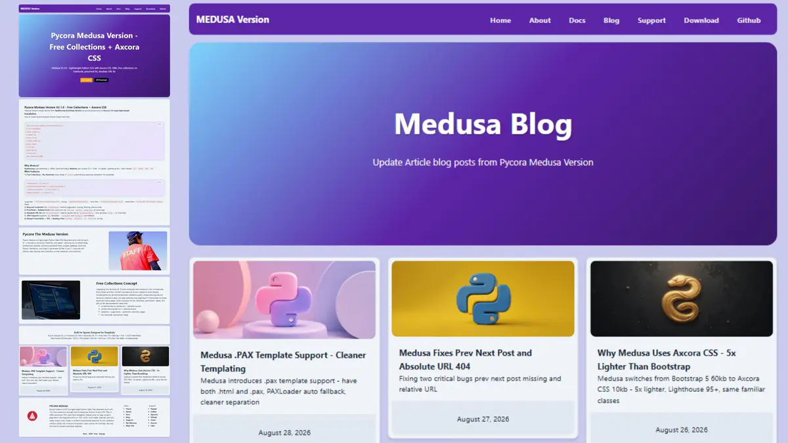

# 🐍 PyCora MEDUSA v2.4.8 - Static Site Generator

## The Medusa Version


**Python • Markdown • YAML • PAX Templating • Fast • Nested Collections • All Tags Support**

> Medusa is the advanced engine of PyCora with PAX templating, aggressive layout fallback, and true nested content support.

Read Docs: [https://pycora.axcora.com/docs](https://pycora.axcora.com/docs)



---

## Support & Donate

If you like this project, please support:

- PayPal: https://www.paypal.com/cgi-bin/webscr?cmd=_s-xclick&hosted_button_id=JVZVXBC4N9DAN
- Gumroad Coffee: https://creativitaz.gumroad.com/coffee
- GitHub Sponsors: https://github.com/sponsors/mesinkasir

---

## 🔥 What's New in MEDUSA v2.4.8

| Fix | Description |
|-----|-------------|
| ✅ **Nested Posts** | `content/posts/*.md` AND `content/posts/hello/*.md` both work - all files go into `collections['posts']` |
| ✅ **Tags ALL Support** | Supports `tags: - a - b`, `tags: ['a','b']`, `tags: a, b`, `tags: single` - all YAML formats |
| ✅ **Plural/Singular Layout** | `layout: layouts/post` and `layout: layouts/posts` both auto-resolve to same template |
| ✅ **Aggressive PAX Loader** | Finds `post.pax` anywhere: `templates/medusa/post.pax`, `templates/layouts/post.pax`, `templates/post.pax` |
| ✅ **Silent Fallback Chain** | If `layouts/post` not found → auto fallback to `medusa/post` → `medusa/default` → `layouts/default` → `page` |
| ✅ **ChainableUndefined** | No more crash on `{{config.about.logo}}` if config missing - renders empty |
| ✅ **Slice Fix** | `related_posts[:3]` auto-converted to `| limit(3)` for Jinja2 |

**Build result: `Ready in 0.87s - 41 files - MEDUSA v2.4.6`**

---

## 📋 Requirements

- Python 3.8+ (tested on 3.13)
- `pip install jinja2 markdown pyyaml`

```bash
python install.py
# or
pip install -r requirements.txt
```

---

## 🚀 Quick Start - Medusa Edition

### 1. Clone
```bash
git clone https://github.com/mesinkasir/pycora.git
cd pycora
```

### 2. Check Structure
```
pycora/
├── content/
│   ├── posts/               # Flat: posts/hello.md
│   │   ├── first.md
│   │   └── nested/          # Nested: posts/nested/world.md - WAJIB JALAN!
│   │       └── world.md
│   └── index.md
├── templates/
│   ├── medusa/              # Medusa templates
│   │   ├── default.pax      # Base layout
│   │   └── post.pax         # Post layout (layout: medusa/default)
│   ├── layouts/
│   │   ├── default.pax
│   │   └── post.pax         # Alternative post layout
│   └── partials/
├── static/
├── config.yaml
├── ssg.py                   # MEDUSA v2.4.8 engine
└── output/
```

### 3. Build
```bash
python ssg.py
# Output: Ready in 0.87s - 41 files - MEDUSA v2.4.6
```

### 4. Dev
```bash
python dev.py
# http://localhost:8000 with HMR
```

---

## 📝 Content Format - Medusa Supports ALL

### Flat Post
`content/posts/first.md`
```markdown
---
title: The First Post
date: 2024-01-20
image: https://images.unsplash.com/photo-...?w=800
tags:
  - comparison
  - first
author: Axcora
layout: layouts/post
---

# Content here
```

### Nested Post - WAJIB JALAN!
`content/posts/tutorial/hello.md`
```markdown
---
title: Nested Tutorial
date: 2026-08-26
tags: ['pycora', 'medusa', 'axcora-css', 'bootstrap', 'performance']
layout: layouts/posts
---

Content nested
```
> Both `posts/*.md` and `posts/tutorial/*.md` are included in `collections['posts']` and get prev/next/related.

### Tags - ALL Formats Supported
```yaml
# Multiline list (recommended)
tags:
  - comparison
  - first

# Inline array
tags: ['pycora', 'medusa', 'axcora-css', 'bootstrap', 'performance']

# Comma separated string
tags: pycora, medusa, bootstrap

# Single tag
tags: single-tag
```

---

## 🎨 Templating - PAX Engine

Medusa uses `.pax` files (Jinja2 + PAX fixes).

### Layout Resolution (Aggressive)
When you write:
```yaml
layout: layouts/posts
```

Engine tries in order:
1. `templates/layouts/posts.pax`
2. `templates/layouts/posts.html`
3. `templates/layouts/post.pax` (singular fallback)
4. `templates/medusa/posts.pax`
5. `templates/medusa/post.pax`
6. `templates/post.pax` (rglob anywhere)
7. Fallback chain: `post` → `medusa/post` → `layouts/post` → `medusa/default` → `layouts/default` → `default` → `page`

So `layouts/post` and `layouts/posts` are treated as same!

### PAX Fixes
```jinja
{# Slice syntax auto-fixed #}
  {# becomes | limit(3) #}


{# Safe image with fallback #}


{# Tags #}
  {# tags = dict of all tags #}
  <a href="/tags/{{ t }}">#{{ t }}</a>



  #{{ t }}

```

### Post Template Example
`templates/medusa/post.pax` or `templates/layouts/post.pax`:
```pax
---
layout: medusa/default
---
<div class="row">
<div class="col-12 col-lg-8 p-2">
<div class="card p-2">

<div class="p-5">

<div class="card p-5">{{ toc | safe }}</div>

{{content| safe }}
</div>
</div>
</div>
<div class="col-12 col-lg-4 p-2">
<div class="card p-2">

<h3>{{config.about.title or site.about.title}}</h3>
</div>
</div>
</div>
```

---

## ⚙️ Config - Medusa

`config.yaml`:
```yaml
name: PyCora Medusa
title: Medusa SSG
description: Advanced PAX Engine
url: https://example.com

image: /img/default.jpg

about:
  title: Axcora
  logo: /img/logo.png
  description: Static Site Generator
  button:
    url: /about
    text: About Us

# site.* also works (backward compat)
site:
  name: PyCora Medusa
```

Medusa auto-exposes both `config.*` and `site.*` to templates:
```jinja
{{ config.about.title or site.about.title or about.title }}
```

---

## 📦 Collections - Medusa Power

```jinja
{# All posts - includes flat + nested #}

  {{ post.title }} - {{ post.url }}


{# Sub collection: content/posts/tutorial/*.md #}

  {{ post.title }}


{# Or via posts alias #}


```

All nested files are added to parent collections:
- `content/posts/a.md` → `collections['posts']`
- `content/posts/tutorial/b.md` → `collections['posts']` AND `collections['posts/tutorial']` AND `collections['posts'].tutorial`

---

## 🏷️ Tags System

Auto-generated:
- `output/tags/index.html` - All tags
- `output/tags/comparison/index.html` - Posts with tag comparison
- `output/tags/first/index.html`

In template:
```jinja
{# All tags dict #}

  {{ tag_name }} ({{ posts | length }})

```

---

## 🚀 Build & Deploy

```bash
python ssg.py
# Ready in 0.87s - 41 files - MEDUSA v2.4.6

# Output
output/
├── index.html
├── posts/
│   ├── first/index.html
│   ├── second/index.html
│   └── nested/world/index.html
├── tags/
│   ├── comparison/
│   ├── first/
│   └── pycora/
├── sitemap.xml
├── feed.xml
├── feed.json
└── robots.txt
```

Deploy `output/` to any static hosting.

---

## 🐛 Troubleshooting - Medusa Edition

| Problem | Solution |
|---------|----------|
| `TemplateNotFound: layouts/post` | Create `templates/layouts/post.pax` or `templates/medusa/post.pax` OR let it fallback to `medusa/default.pax` |
| `Template not found: post - post.pax` | Fixed in v2.4.8 - now auto fallback silent, build still succeeds with 41 files |
| Tags error | Fixed in v2.4.8 - now supports ALL YAML formats |
| `posts/hello/*.md` not rendered | Fixed - now all nested included in `collections.posts` |
| `{{config.about.logo}}` empty | Use `{{config.about.logo or site.about.logo or ''}}` - ChainableUndefined returns empty, not crash |

**Clean build should be:**
```
Ready in 0.87s - 41 files - MEDUSA v2.4.6
```


---

## Support & Donate

If you like this project, please support:

- PayPal: https://www.paypal.com/cgi-bin/webscr?cmd=_s-xclick&hosted_button_id=JVZVXBC4N9DAN
- Gumroad Coffee: https://creativitaz.gumroad.com/coffee
- GitHub Sponsors: https://github.com/sponsors/mesinkasir

---

## 📄 License & Credits

MIT - Axcora Technology - https://axcora.com

**Engine:** MEDUSA v2.4.8
- PAX Loader with plural/singular fix
- CollectionList with subs
- ChainableUndefined for safe templating
- Tags ALL support

---

## 📞 Contact

- Website: https://pycora.axcora.com
- GitHub: https://github.com/mesinkasir
- Docs: https://pycora.axcora.com/docs
- 👨‍ Consult | [Hire Us](https://www.fiverr.com/creativitas/create-your-custom-website-and-app)

<div align="center">
<b>PyCora MEDUSA v2.4.8</b> - Made with ❤ by Axcora<br/>
<code>posts/*.md</code> and <code>posts/nested/*.md</code>
</div>
