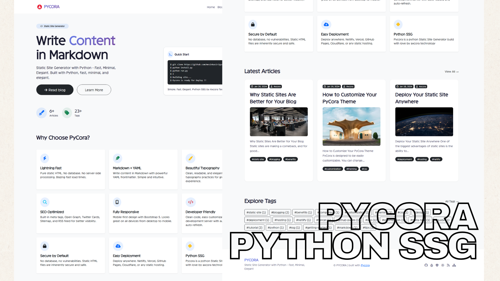

# 🚀 PyCora - Static Site Generator

**Python • Markdown • YAML • Fast • Minimal • Elegant • Pro**

Read Docs: [https://pycora.axcora.com/](https://pycora.axcora.com/)

---

## Support & Donate

If you like this project, please support:

- PayPal: https://www.paypal.com/cgi-bin/webscr?cmd=_s-xclick&hosted_button_id=JVZVXBC4N9DAN
- Gumroad Coffee: https://creativitaz.gumroad.com/coffee
- GitHub Sponsors: https://github.com/sponsors/mesinkasir
- [Hire Us](https://www.fiverr.com/creativitas/create-your-custom-website-and-app)

---

## 🔀 Choose Your Engine - 2 Versions

Click the image to go to the branch.

<table>
<tr>
<td width="50%" align="center">
<a href="https://github.com/mesinkasir/pycora/tree/medusa">

</a>
</td>
<td width="50%" align="center">
<a href="https://github.com/mesinkasir/pycora/tree/nyi-blorong">

</a>
</td>
</tr>
<tr>
<td width="50%" align="center">

### 🐍 MEDUSA - Full Pro


**Advanced PAX Engine - Complete, Powerful, Pro**

- ✅ `content/posts/*.md` AND `content/posts/hello/*.md` BOTH WORK
- ✅ Tags ALL formats: `- a`, `['a','b']`, `a, b`, `single`
- ✅ `layouts/post` = `layouts/posts` (plural/singular auto)
- ✅ PAX `.pax` + Aggressive loader + Silent fallback
- ✅ ChainableUndefined, Slice fix `[:3]` → `| limit(3)`

**Best for:** Pro projects, docs, nested content, large blogs

**Build:** `Ready in 0.87s - 41 files`

[→ Explore Medusa Branch](https://github.com/mesinkasir/pycora/tree/medusa)

</td>
<td width="50%" align="center">

### 🐉 NYI BLORONG - Simple



**Simple Jinja Engine - Minimal, Lightweight, Easy**

- ✅ Pure Jinja2 `.html` - familiar
- ✅ Markdown + YAML only
- ✅ Lightweight, zero learning curve
- ✅ Tags, Pagination, SEO, Sitemap, RSS

**Best for:** Beginners, personal blog, company profile

**Build:** `Done! 2 posts, 2 tags.`

[→ Explore Nyi Blorong Branch](https://github.com/mesinkasir/pycora/tree/nyi-blorong)

</td>
</tr>
</table>

> **Simple explanation:** Nyi Blorong = Simple Jinja for quick start without complexity. Medusa = Complete with PAX, nested, Tags ALL, fallback - for power and pro look. Detailed docs are in each branch README.

---

## 📋 Requirements

- Python 3.8+
- `pip install jinja2 markdown pyyaml watchdog`

```bash
python install.py
```

---

## 🚀 Quick Start

### Medusa (Pro - Recommended for main to look PRO)

```bash
git clone https://github.com/mesinkasir/pycora.git
cd pycora
git checkout medusa
python ssg.py
# Ready in 0.87s - 41 files - MEDUSA v2.4.6
python dev.py
```

### Nyi Blorong (Simple)

```bash
git clone https://github.com/mesinkasir/pycora.git
cd pycora
git checkout nyi-blorong
python ssg.py
python dev.py
```

---

## 📁 Project Structure

```
pycora/
├── content/posts/
│   ├── first.md
│   └── tutorial/nested.md    # Nested - ONLY Medusa auto includes
├── templates/
│   ├── medusa/               # Medusa: .pax
│   └── layouts/              # Nyi Blorong: .html
├── medusa.webp               # Clickable to medusa branch
├── nyiblorong.webp           # Clickable to nyi-blorong branch
├── ssg.py
└── output/
```

---

## 🌐 Deployment

```bash
python ssg.py
# Upload output/ to Netlify, Vercel, GitHub Pages
```

---

## 💖 Support & Donate

If you like this project, please support:

- **PayPal:** https://www.paypal.com/cgi-bin/webscr?cmd=_s-xclick&hosted_button_id=JVZVXBC4N9DAN
- **Gumroad Coffee:** https://creativitaz.gumroad.com/coffee
- **GitHub Sponsors:** https://github.com/sponsors/mesinkasir
- **[Hire Us](https://www.fiverr.com/creativitas/create-your-custom-website-and-app)**

---

## 🤔 Which version for main to look PRO?

**Use MEDUSA as main to look PRO.**

Why?
- Full features: nested, Tags ALL, PAX, fallback - looks mature and production-ready
- Nyi Blorong is great for beginners, but keep it in branch
- Main = Medusa makes your repo look pro on GitHub Explore

```bash
git checkout main
git merge medusa --no-ff -m "feat: Medusa v2.4.8 as main PRO engine"
git push origin main
```

- Main / Medusa = PRO
- Nyi Blorong branch = Simple

---

## 📄 License

MIT - Axcora Technology

## 📞 Contact

- Website: https://pycora.axcora.com
- GitHub: https://github.com/mesinkasir/pycora
- Pro: https://github.com/mesinkasir/pycora/tree/medusa
- Simple: https://github.com/mesinkasir/pycora/tree/nyi-blorong

<div align="center">
<b>PyCora</b> - Click image to choose engine<br/>
Made with ❤ by Axcora
</div>
